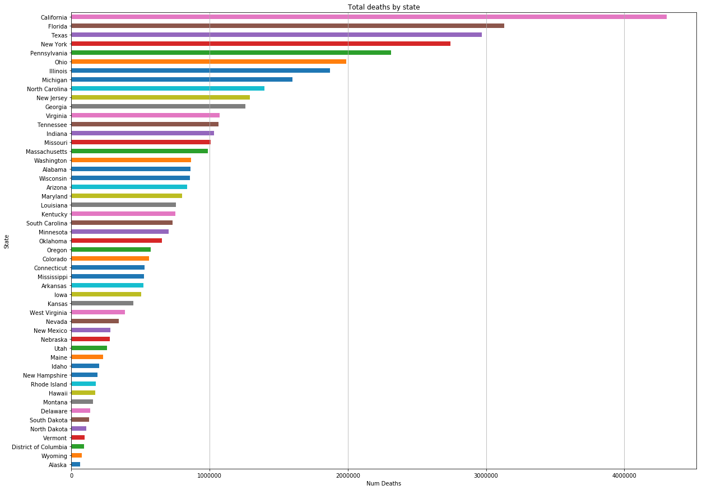
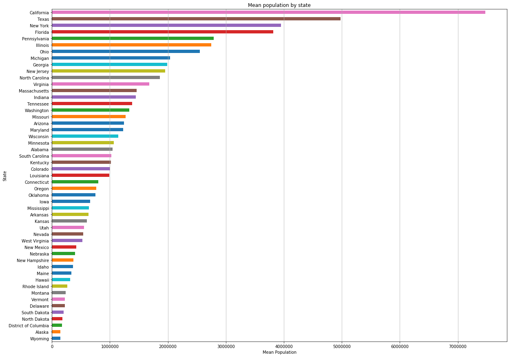
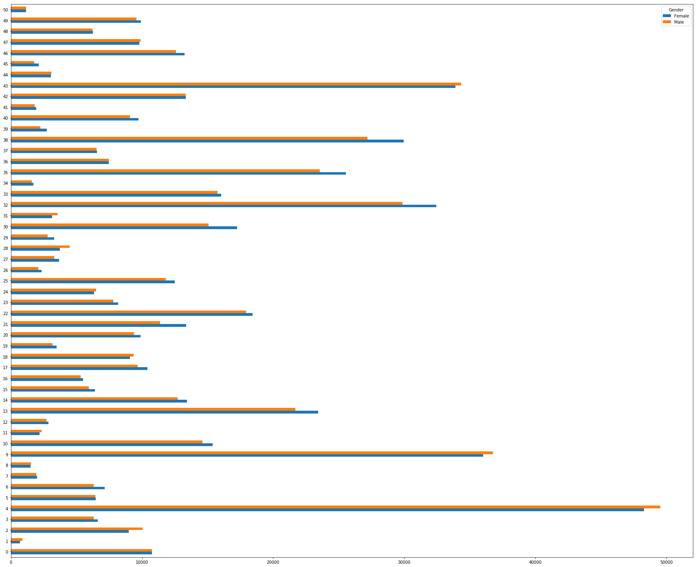
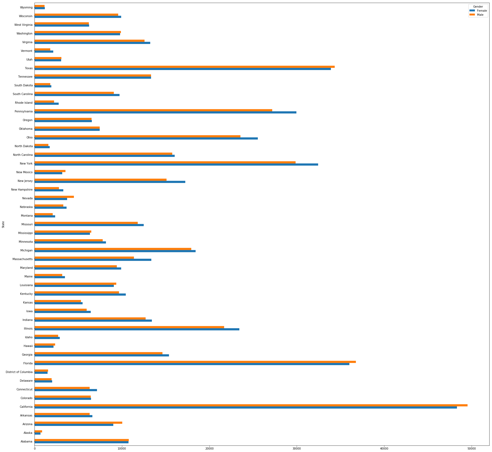
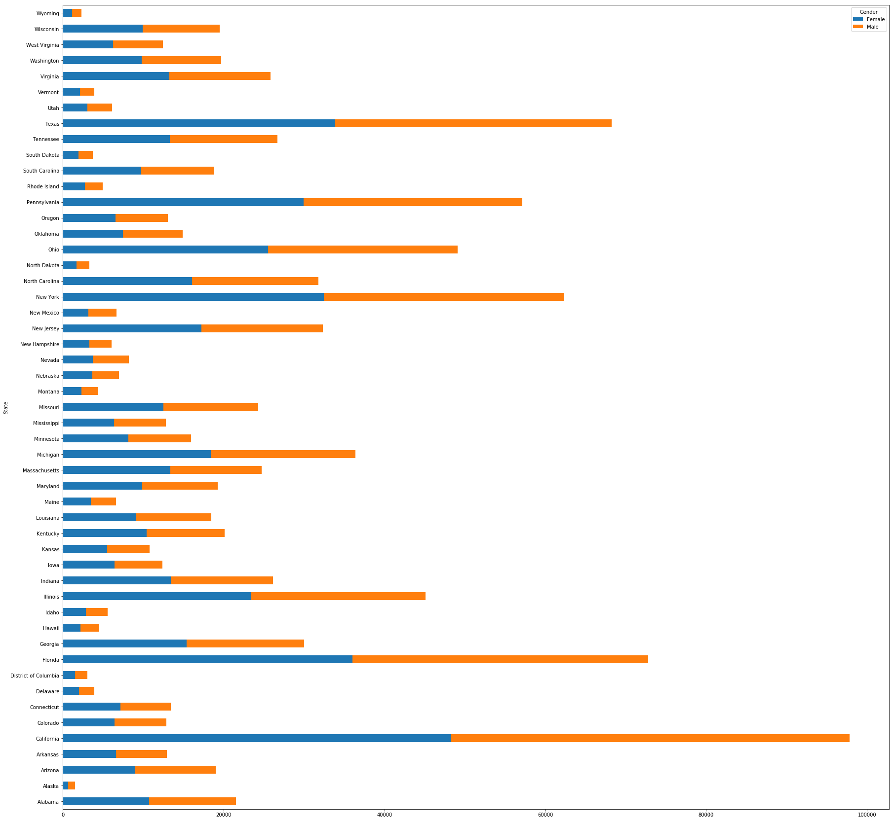

# Pivot Tables with Pandas - Lab

## Introduction

In this lab, we'll learn how to make use of our newfound knowledge of pivot tables to work with real-world data.  We'll start by exploring 

## Objectives

You will be able to:

* Understand and explain what a multi-level hierarchical index is
* Understand, explain the difference and use df.pivot and pd.pivot_table
* Switch between “long” and “wide” in a DataFrame using stack() and unstack()
* Transform “wide” to “long” DataFrames using `melt`

## Getting Started

### Import Pandas and Matplotlib.pyplot Using Standard Aliases

In the cell below:

* Import `pandas` and set the standard alias
* Import `matplotlib.pyplot` and set the standard alias
* Run the ipython magic command to display matplotlib graphs inline within the notebook


```python
import pandas as pd
import matplotlib.pyplot as plt
%matplotlib inline
```

## Load the Data
The data for this activity is stored in a file called `'causes_of_death.tsv'` which is a somewhat morbid dataset from the center for disease control. Note that the file extension .tsv indicates that this data is formatted slightly differently then the standard .csv, the difference being that it has 'tab seperated values' instead of 'comma seperated values'. As such, pass in the optional parameter `delimiter='\t'` into the `pd.read_csv()` method.


```python
df = pd.read_csv('causes_of_death.tsv', delimiter='\t')
```

Now, display the head of the DataFrame to ensure everything loaded correctly.


```python
df.head()
```


<div>
<style scoped>
    .dataframe tbody tr th:only-of-type {
        vertical-align: middle;
    }

    .dataframe tbody tr th {
        vertical-align: top;
    }

    .dataframe thead th {
        text-align: right;
    }
</style>
<table border="1" class="dataframe">
  <thead>
    <tr style="text-align: right;">
      <th></th>
      <th>Notes</th>
      <th>State</th>
      <th>State Code</th>
      <th>Ten-Year Age Groups</th>
      <th>Ten-Year Age Groups Code</th>
      <th>Gender</th>
      <th>Gender Code</th>
      <th>Race</th>
      <th>Race Code</th>
      <th>Deaths</th>
      <th>Population</th>
      <th>Crude Rate</th>
    </tr>
  </thead>
  <tbody>
    <tr>
      <th>0</th>
      <td>NaN</td>
      <td>Alabama</td>
      <td>1</td>
      <td>&lt; 1 year</td>
      <td>1</td>
      <td>Female</td>
      <td>F</td>
      <td>American Indian or Alaska Native</td>
      <td>1002-5</td>
      <td>14</td>
      <td>3579</td>
      <td>Unreliable</td>
    </tr>
    <tr>
      <th>1</th>
      <td>NaN</td>
      <td>Alabama</td>
      <td>1</td>
      <td>&lt; 1 year</td>
      <td>1</td>
      <td>Female</td>
      <td>F</td>
      <td>Asian or Pacific Islander</td>
      <td>A-PI</td>
      <td>24</td>
      <td>7443</td>
      <td>322.5</td>
    </tr>
    <tr>
      <th>2</th>
      <td>NaN</td>
      <td>Alabama</td>
      <td>1</td>
      <td>&lt; 1 year</td>
      <td>1</td>
      <td>Female</td>
      <td>F</td>
      <td>Black or African American</td>
      <td>2054-5</td>
      <td>2093</td>
      <td>169339</td>
      <td>1236.0</td>
    </tr>
    <tr>
      <th>3</th>
      <td>NaN</td>
      <td>Alabama</td>
      <td>1</td>
      <td>&lt; 1 year</td>
      <td>1</td>
      <td>Female</td>
      <td>F</td>
      <td>White</td>
      <td>2106-3</td>
      <td>2144</td>
      <td>347921</td>
      <td>616.2</td>
    </tr>
    <tr>
      <th>4</th>
      <td>NaN</td>
      <td>Alabama</td>
      <td>1</td>
      <td>&lt; 1 year</td>
      <td>1</td>
      <td>Male</td>
      <td>M</td>
      <td>Asian or Pacific Islander</td>
      <td>A-PI</td>
      <td>33</td>
      <td>7366</td>
      <td>448.0</td>
    </tr>
  </tbody>
</table>
</div>


Our data is currently in **_Wide_** format.  We can tidy this up by converting it to **_Long_** format by using groupby statements to aggregate our data into a much neater, more readable format. 

# Groupby Aggregations

Complete the following groupby statements.

# 1) Groupby State and Gender. Sum the values.


```python
# Your code here
df.groupby(['State', "Gender"])['Deaths'].sum()
```


    State                 Gender
    Alabama               Female     430133
                          Male       430647
    Alaska                Female      27199
                          Male        36135
    Arizona               Female     396028
                          Male       442066
    Arkansas              Female     258243
                          Male       264671
    California            Female    2125965
                          Male      2181096
    Colorado              Female     277787
                          Male       283496
    Connecticut           Female     278653
                          Male       252637
    Delaware              Female      68001
                          Male        67932
    District of Columbia  Female      46436
                          Male        47637
    Florida               Female    1512891
                          Male      1618220
    Georgia               Female     630265
                          Male       628752
    Hawaii                Female      78586
                          Male        93658
    Idaho                 Female      97727
                          Male       102350
    Illinois              Female     960785
                          Male       911386
    Indiana               Female     523603
                          Male       508031
                                     ...   
    Oklahoma              Female     327885
                          Male       328650
    Oregon                Female     288677
                          Male       287275
    Pennsylvania          Female    1199018
                          Male      1114837
    Rhode Island          Female      93397
                          Male        82869
    South Carolina        Female     360313
                          Male       372258
    South Dakota          Female      63781
                          Male        64818
    Tennessee             Female     533373
                          Male       533354
    Texas                 Female    1457648
                          Male      1511566
    Utah                  Female     127955
                          Male       132524
    Vermont               Female      48868
                          Male        46432
    Virginia              Female     542518
                          Male       528645
    Washington            Female     431062
                          Male       434624
    West Virginia         Female     193664
                          Male       192560
    Wisconsin             Female     436397
                          Male       421232
    Wyoming               Female      37153
                          Male        40233
    Name: Deaths, Length: 102, dtype: int64


# 2) Groupby State and Gender and Race. Find the average values.


```python
# Your code here
df.groupby(['State', "Gender", "Race"]).Deaths.mean()
```


    State          Gender  Race                            
    Alabama        Female  American Indian or Alaska Native       70.875000
                           Asian or Pacific Islander              95.500000
                           Black or African American            9074.000000
                           White                               29890.636364
                   Male    American Indian or Alaska Native       86.375000
                           Asian or Pacific Islander              78.400000
                           Black or African American            9298.000000
                           White                               27241.166667
    Alaska         Female  American Indian or Alaska Native      597.909091
                           Asian or Pacific Islander             124.777778
                           Black or African American              79.444444
                           White                                1707.636364
                   Male    American Indian or Alaska Native      738.272727
                           Asian or Pacific Islander             122.400000
                           Black or African American             106.400000
                           White                                2338.727273
    Arizona        Female  American Indian or Alaska Native     1309.727273
                           Asian or Pacific Islander             376.272727
                           Black or African American             995.090909
                           White                               30544.666667
                   Male    American Indian or Alaska Native     1586.500000
                           Asian or Pacific Islander             365.272727
                           Black or African American            1130.083333
                           White                               33787.416667
    Arkansas       Female  American Indian or Alaska Native       61.571429
                           Asian or Pacific Islander              86.900000
                           Black or African American            3136.818182
                           White                               20221.636364
                   Male    American Indian or Alaska Native       64.111111
                           Asian or Pacific Islander              84.636364
                                                                   ...     
    Washington     Female  Black or African American             913.727273
                           White                               36369.272727
                   Male    American Indian or Alaska Native      625.818182
                           Asian or Pacific Islander            1375.727273
                           Black or African American            1221.818182
                           White                               33263.916667
    West Virginia  Female  American Indian or Alaska Native       16.250000
                           Asian or Pacific Islander              36.600000
                           Black or African American             534.818182
                           White                               17048.454545
                   Male    American Indian or Alaska Native       15.250000
                           Asian or Pacific Islander              28.800000
                           Black or African American             543.545455
                           White                               16943.272727
    Wisconsin      Female  American Indian or Alaska Native      273.181818
                           Asian or Pacific Islander             218.727273
                           Black or African American            1645.000000
                           White                               37535.545455
                   Male    American Indian or Alaska Native      306.636364
                           Asian or Pacific Islander             221.000000
                           Black or African American            1861.181818
                           White                               35905.000000
    Wyoming        Female  American Indian or Alaska Native       77.500000
                           Asian or Pacific Islander              24.200000
                           Black or African American              30.500000
                           White                                3279.454545
                   Male    American Indian or Alaska Native      103.000000
                           Asian or Pacific Islander              15.000000
                           Black or African American              28.333333
                           White                                3533.909091
    Name: Deaths, Length: 408, dtype: float64


# 3) Groupby Gender and Race. Find the minimum values.


```python
# Your code here
df.groupby(["Gender", "Race"]).Deaths.min()
```


    Gender  Race                            
    Female  American Indian or Alaska Native    10
            Asian or Pacific Islander           10
            Black or African American           10
            White                               12
    Male    American Indian or Alaska Native    10
            Asian or Pacific Islander           10
            Black or African American           10
            White                               10
    Name: Deaths, dtype: int64


## 4) Create a bar chart of the total number of deaths by state.
* Sort your columns in order (ascending or descending are both acceptable).  
* Also make sure to include a title, axes labels and have your graph be an appropriate size.

**_NOTE:_** In order to do this, slice the `Deaths` column after the `.groupby()` method, but before the `sum()` method.  You can even chain the `.plot()` call on after the `sum()` call and do this all on one line, excluding the labeling of the graph!


```python
#Your code here
df.groupby(['State'])['Deaths'].sum().sort_values().plot(kind='barh', figsize=(20,15))
plt.title("Total deaths by state")
plt.xlabel('Num Deaths')
plt.gca().xaxis.grid(True)
```





### Inspecting our Data

Let's go one step further and get a print-out of the data type of each column. 

In the cell below, get the `.info()` of our DataFrame, and note the data type that each column is currently stored as.  


```python
df.info()
```

    <class 'pandas.core.frame.DataFrame'>
    RangeIndex: 4115 entries, 0 to 4114
    Data columns (total 12 columns):
    Notes                       0 non-null float64
    State                       4115 non-null object
    State Code                  4115 non-null int64
    Ten-Year Age Groups         4115 non-null object
    Ten-Year Age Groups Code    4115 non-null object
    Gender                      4115 non-null object
    Gender Code                 4115 non-null object
    Race                        4115 non-null object
    Race Code                   4115 non-null object
    Deaths                      4115 non-null int64
    Population                  4115 non-null object
    Crude Rate                  4115 non-null object
    dtypes: float64(1), int64(2), object(9)
    memory usage: 385.9+ KB


Let's look at some samples from the Population column to see if the current encoding seems appropriate for the data it contains. 

In the cell below, display the population values for the first 5 rows in the DataFrame.  


```python
df.Population.iloc[:5]
```


    0      3579
    1      7443
    2    169339
    3    347921
    4      7366
    Name: Population, dtype: object


Just to be extra sure, let's check the value counts to see how many times each unqiue value shows up in the dataset. We'll only look at the top 5. 

In the cell below, print out the top 5 `value_counts()` of the population column of the DataFrame. 


```python
df.Population.value_counts().sort_values()[:5]
```


    867814     1
    750849     1
    1562806    1
    116420     1
    49064      1
    Name: Population, dtype: int64


Clearly, this data should be stored as a numeric type, not a categorical type.  

### 5a) Reformat the Population Column as an Integer
As stands, not all values will be able to be reformated as integers. Most of the cells in the the `Population` column contain integer values, but the entire column is currently encoded in string format because some cells contain the string `"Not Applicable"`.

We need to remove these rows before we can cast the Population column to an Integer data type. 

In the cell below:

* Slice the rows of `df` where the Population column is equal to `'Not Applicable'`.
* Use `to_drop.index`  to drop the offending rows from `df`. Be sure to set the `axis=0`, and `inplace=True`
* Cast the Population column to an integer data type using the `.astype()` function, with the single parameter `int64` passed in. 
* Print the Population column's `dtype` attribute to confirm it is now stored in `int64` format. 

**_NOTE:_** `.astype()` returns a copy of the column, so make sure you set the Population column equal to what this method returns--don't just call it!


```python
#Your code here
to_drop = df[df['Population'] == 'Not Applicable']
df.drop(to_drop.index, inplace=True, axis=0)
df['Population'] = df['Population'].astype('int64')
df['Population'].dtype
```


    dtype('int64')


### 5b) Complete the Bar Chart

Now that we've reformatted our data, let's create a bar chart of the of the Mean Population by State.


```python
#Your code here
df.groupby('State').Population.mean().sort_values().plot(kind='barh', figsize=(20,15))
plt.title('Mean population by state')
plt.xlabel('Mean Population')
plt.gca().xaxis.grid(True)
```





Below we will investigate how we can combine the **pivot** method along with the **groupby** method to combine some cool **stacked bar charts**!

### Using Aggregate Functions

In the cell below:

* Group `df` by `'State'` and  `'Gender'`, and then slice both `'Death'` and `'Population'` from it. Chain the `.agg()` method to return the mean, min, max, and standard deviation these sliced columns. 

**_NOTE:_** This only requires one line of code.  

By now, you've probably caught on that the code required to do this follows this pattern:    `([things to group by])[columns to slice].agg([aggregates to return])`

Then, display the head of this of this new DataFrame.


```python
# A sample groupby similar to above. 
grouped = df.groupby(['State', 'Gender'])['Deaths', 'Population'].agg(['mean','min','max', 'std'])
grouped
```


<div>
<style scoped>
    .dataframe tbody tr th:only-of-type {
        vertical-align: middle;
    }

    .dataframe tbody tr th {
        vertical-align: top;
    }

    .dataframe thead tr th {
        text-align: left;
    }

    .dataframe thead tr:last-of-type th {
        text-align: right;
    }
</style>
<table border="1" class="dataframe">
  <thead>
    <tr>
      <th></th>
      <th></th>
      <th colspan="4" halign="left">Deaths</th>
      <th colspan="4" halign="left">Population</th>
    </tr>
    <tr>
      <th></th>
      <th></th>
      <th>mean</th>
      <th>min</th>
      <th>max</th>
      <th>std</th>
      <th>mean</th>
      <th>min</th>
      <th>max</th>
      <th>std</th>
    </tr>
    <tr>
      <th>State</th>
      <th>Gender</th>
      <th></th>
      <th></th>
      <th></th>
      <th></th>
      <th></th>
      <th></th>
      <th></th>
      <th></th>
    </tr>
  </thead>
  <tbody>
    <tr>
      <th rowspan="2" valign="top">Alabama</th>
      <th>Female</th>
      <td>10753.325000</td>
      <td>10</td>
      <td>116297</td>
      <td>24612.250487</td>
      <td>1.078713e+06</td>
      <td>2087</td>
      <td>4334752</td>
      <td>1.400309e+06</td>
    </tr>
    <tr>
      <th>Male</th>
      <td>10765.850000</td>
      <td>10</td>
      <td>88930</td>
      <td>20813.538537</td>
      <td>1.014946e+06</td>
      <td>1129</td>
      <td>4284775</td>
      <td>1.397830e+06</td>
    </tr>
    <tr>
      <th rowspan="2" valign="top">Alaska</th>
      <th>Female</th>
      <td>679.975000</td>
      <td>13</td>
      <td>4727</td>
      <td>1154.870455</td>
      <td>1.440403e+05</td>
      <td>1224</td>
      <td>682855</td>
      <td>2.015793e+05</td>
    </tr>
    <tr>
      <th>Male</th>
      <td>860.357143</td>
      <td>12</td>
      <td>5185</td>
      <td>1411.777392</td>
      <td>1.518884e+05</td>
      <td>578</td>
      <td>770502</td>
      <td>2.238843e+05</td>
    </tr>
    <tr>
      <th rowspan="2" valign="top">Arizona</th>
      <th>Female</th>
      <td>8998.386364</td>
      <td>21</td>
      <td>133923</td>
      <td>26245.941003</td>
      <td>1.246502e+06</td>
      <td>12211</td>
      <td>6265346</td>
      <td>2.096632e+06</td>
    </tr>
    <tr>
      <th>Male</th>
      <td>10036.204545</td>
      <td>28</td>
      <td>110347</td>
      <td>24736.056309</td>
      <td>1.235121e+06</td>
      <td>6877</td>
      <td>6692127</td>
      <td>2.129562e+06</td>
    </tr>
    <tr>
      <th rowspan="2" valign="top">Arkansas</th>
      <th>Female</th>
      <td>6621.615385</td>
      <td>11</td>
      <td>81126</td>
      <td>16794.044835</td>
      <td>6.650842e+05</td>
      <td>1766</td>
      <td>2878953</td>
      <td>9.620027e+05</td>
    </tr>
    <tr>
      <th>Male</th>
      <td>6301.690476</td>
      <td>10</td>
      <td>61671</td>
      <td>14165.374833</td>
      <td>5.952392e+05</td>
      <td>818</td>
      <td>2844754</td>
      <td>9.479750e+05</td>
    </tr>
    <tr>
      <th rowspan="2" valign="top">California</th>
      <th>Female</th>
      <td>48312.840909</td>
      <td>37</td>
      <td>720306</td>
      <td>132121.217672</td>
      <td>7.511866e+06</td>
      <td>40061</td>
      <td>35338781</td>
      <td>1.108854e+07</td>
    </tr>
    <tr>
      <th>Male</th>
      <td>49555.522727</td>
      <td>42</td>
      <td>473226</td>
      <td>108799.190468</td>
      <td>7.436590e+06</td>
      <td>22096</td>
      <td>38013386</td>
      <td>1.161212e+07</td>
    </tr>
    <tr>
      <th rowspan="2" valign="top">Colorado</th>
      <th>Female</th>
      <td>6460.162791</td>
      <td>11</td>
      <td>102790</td>
      <td>19302.972849</td>
      <td>1.011925e+06</td>
      <td>3638</td>
      <td>5769346</td>
      <td>1.830517e+06</td>
    </tr>
    <tr>
      <th>Male</th>
      <td>6442.500000</td>
      <td>11</td>
      <td>67020</td>
      <td>15771.618909</td>
      <td>9.990418e+05</td>
      <td>2021</td>
      <td>5980727</td>
      <td>1.886827e+06</td>
    </tr>
    <tr>
      <th rowspan="2" valign="top">Connecticut</th>
      <th>Female</th>
      <td>7144.641026</td>
      <td>12</td>
      <td>123075</td>
      <td>22486.493850</td>
      <td>8.330746e+05</td>
      <td>1300</td>
      <td>4284249</td>
      <td>1.263293e+06</td>
    </tr>
    <tr>
      <th>Male</th>
      <td>6315.300000</td>
      <td>11</td>
      <td>65879</td>
      <td>15808.791538</td>
      <td>7.695114e+05</td>
      <td>737</td>
      <td>4124481</td>
      <td>1.236443e+06</td>
    </tr>
    <tr>
      <th rowspan="2" valign="top">Delaware</th>
      <th>Female</th>
      <td>2000.029412</td>
      <td>11</td>
      <td>21627</td>
      <td>4641.612706</td>
      <td>2.319277e+05</td>
      <td>516</td>
      <td>854369</td>
      <td>2.788162e+05</td>
    </tr>
    <tr>
      <th>Male</th>
      <td>1940.914286</td>
      <td>13</td>
      <td>15976</td>
      <td>3808.261525</td>
      <td>2.132271e+05</td>
      <td>249</td>
      <td>822548</td>
      <td>2.720394e+05</td>
    </tr>
    <tr>
      <th rowspan="2" valign="top">District of Columbia</th>
      <th>Female</th>
      <td>1497.580645</td>
      <td>11</td>
      <td>10428</td>
      <td>2679.916190</td>
      <td>1.809390e+05</td>
      <td>438</td>
      <td>610212</td>
      <td>1.795778e+05</td>
    </tr>
    <tr>
      <th>Male</th>
      <td>1534.806452</td>
      <td>10</td>
      <td>7066</td>
      <td>2265.979588</td>
      <td>1.632496e+05</td>
      <td>1015</td>
      <td>598018</td>
      <td>1.664408e+05</td>
    </tr>
    <tr>
      <th rowspan="2" valign="top">Florida</th>
      <th>Female</th>
      <td>36019.071429</td>
      <td>19</td>
      <td>550300</td>
      <td>104255.285830</td>
      <td>3.992259e+06</td>
      <td>6496</td>
      <td>18892377</td>
      <td>5.898359e+06</td>
    </tr>
    <tr>
      <th>Male</th>
      <td>36771.340909</td>
      <td>10</td>
      <td>411612</td>
      <td>91930.916198</td>
      <td>3.646189e+06</td>
      <td>3700</td>
      <td>18346677</td>
      <td>5.732988e+06</td>
    </tr>
    <tr>
      <th rowspan="2" valign="top">Georgia</th>
      <th>Female</th>
      <td>15372.317073</td>
      <td>20</td>
      <td>162447</td>
      <td>33653.636538</td>
      <td>2.077332e+06</td>
      <td>1804</td>
      <td>7872387</td>
      <td>2.585815e+06</td>
    </tr>
    <tr>
      <th>Male</th>
      <td>14621.069767</td>
      <td>12</td>
      <td>116794</td>
      <td>27570.074438</td>
      <td>1.900328e+06</td>
      <td>808</td>
      <td>8150562</td>
      <td>2.614520e+06</td>
    </tr>
    <tr>
      <th rowspan="2" valign="top">Hawaii</th>
      <th>Female</th>
      <td>2182.944444</td>
      <td>10</td>
      <td>23476</td>
      <td>4781.899001</td>
      <td>3.259614e+05</td>
      <td>232</td>
      <td>1136814</td>
      <td>3.778703e+05</td>
    </tr>
    <tr>
      <th>Male</th>
      <td>2341.450000</td>
      <td>11</td>
      <td>18791</td>
      <td>4436.617804</td>
      <td>2.987045e+05</td>
      <td>183</td>
      <td>1081608</td>
      <td>3.634770e+05</td>
    </tr>
    <tr>
      <th rowspan="2" valign="top">Idaho</th>
      <th>Female</th>
      <td>2874.323529</td>
      <td>11</td>
      <td>38088</td>
      <td>7990.822485</td>
      <td>3.863173e+05</td>
      <td>419</td>
      <td>1881123</td>
      <td>6.495782e+05</td>
    </tr>
    <tr>
      <th>Male</th>
      <td>2693.421053</td>
      <td>15</td>
      <td>27053</td>
      <td>6665.940386</td>
      <td>3.495179e+05</td>
      <td>315</td>
      <td>1988638</td>
      <td>6.417280e+05</td>
    </tr>
    <tr>
      <th rowspan="2" valign="top">Illinois</th>
      <th>Female</th>
      <td>23432.926829</td>
      <td>13</td>
      <td>348960</td>
      <td>64838.079239</td>
      <td>2.832461e+06</td>
      <td>3753</td>
      <td>12964858</td>
      <td>4.112687e+06</td>
    </tr>
    <tr>
      <th>Male</th>
      <td>21698.000000</td>
      <td>15</td>
      <td>210711</td>
      <td>47947.187466</td>
      <td>2.663851e+06</td>
      <td>1866</td>
      <td>13036061</td>
      <td>4.180657e+06</td>
    </tr>
    <tr>
      <th rowspan="2" valign="top">Indiana</th>
      <th>Female</th>
      <td>13425.717949</td>
      <td>11</td>
      <td>185795</td>
      <td>37468.783350</td>
      <td>1.490349e+06</td>
      <td>1559</td>
      <td>7269071</td>
      <td>2.401351e+06</td>
    </tr>
    <tr>
      <th>Male</th>
      <td>12700.275000</td>
      <td>12</td>
      <td>126266</td>
      <td>29618.163156</td>
      <td>1.406879e+06</td>
      <td>745</td>
      <td>7251271</td>
      <td>2.404957e+06</td>
    </tr>
    <tr>
      <th>...</th>
      <th>...</th>
      <td>...</td>
      <td>...</td>
      <td>...</td>
      <td>...</td>
      <td>...</td>
      <td>...</td>
      <td>...</td>
      <td>...</td>
    </tr>
    <tr>
      <th rowspan="2" valign="top">Oklahoma</th>
      <th>Female</th>
      <td>7451.931818</td>
      <td>11</td>
      <td>103703</td>
      <td>20397.710505</td>
      <td>7.583726e+05</td>
      <td>3398</td>
      <td>3690487</td>
      <td>1.147773e+06</td>
    </tr>
    <tr>
      <th>Male</th>
      <td>7468.909091</td>
      <td>14</td>
      <td>76790</td>
      <td>17197.152298</td>
      <td>7.406930e+05</td>
      <td>1784</td>
      <td>3727190</td>
      <td>1.161719e+06</td>
    </tr>
    <tr>
      <th rowspan="2" valign="top">Oregon</th>
      <th>Female</th>
      <td>6560.840909</td>
      <td>10</td>
      <td>115055</td>
      <td>21138.542646</td>
      <td>7.700212e+05</td>
      <td>3684</td>
      <td>4445056</td>
      <td>1.392213e+06</td>
    </tr>
    <tr>
      <th>Male</th>
      <td>6528.977273</td>
      <td>13</td>
      <td>74395</td>
      <td>17478.932830</td>
      <td>7.554883e+05</td>
      <td>2146</td>
      <td>4360942</td>
      <td>1.403282e+06</td>
    </tr>
    <tr>
      <th rowspan="2" valign="top">Pennsylvania</th>
      <th>Female</th>
      <td>29972.575000</td>
      <td>10</td>
      <td>473687</td>
      <td>89923.668919</td>
      <td>2.899813e+06</td>
      <td>3125</td>
      <td>14615429</td>
      <td>4.481634e+06</td>
    </tr>
    <tr>
      <th>Male</th>
      <td>27187.463415</td>
      <td>20</td>
      <td>297094</td>
      <td>66807.101332</td>
      <td>2.680192e+06</td>
      <td>1537</td>
      <td>14353314</td>
      <td>4.400761e+06</td>
    </tr>
    <tr>
      <th rowspan="2" valign="top">Rhode Island</th>
      <th>Female</th>
      <td>2746.970588</td>
      <td>10</td>
      <td>42473</td>
      <td>8334.872239</td>
      <td>2.822031e+05</td>
      <td>860</td>
      <td>1299155</td>
      <td>4.254615e+05</td>
    </tr>
    <tr>
      <th>Male</th>
      <td>2239.243243</td>
      <td>11</td>
      <td>22680</td>
      <td>5553.951543</td>
      <td>2.441573e+05</td>
      <td>339</td>
      <td>1221142</td>
      <td>3.995845e+05</td>
    </tr>
    <tr>
      <th rowspan="2" valign="top">South Carolina</th>
      <th>Female</th>
      <td>9737.891892</td>
      <td>25</td>
      <td>93345</td>
      <td>20390.325422</td>
      <td>1.107621e+06</td>
      <td>1218</td>
      <td>3984833</td>
      <td>1.322357e+06</td>
    </tr>
    <tr>
      <th>Male</th>
      <td>9078.292683</td>
      <td>12</td>
      <td>72346</td>
      <td>17092.434648</td>
      <td>9.492162e+05</td>
      <td>557</td>
      <td>3883447</td>
      <td>1.296708e+06</td>
    </tr>
    <tr>
      <th rowspan="2" valign="top">South Dakota</th>
      <th>Female</th>
      <td>1932.757576</td>
      <td>14</td>
      <td>28814</td>
      <td>5607.382037</td>
      <td>2.143276e+05</td>
      <td>264</td>
      <td>891368</td>
      <td>3.086021e+05</td>
    </tr>
    <tr>
      <th>Male</th>
      <td>1800.500000</td>
      <td>10</td>
      <td>17216</td>
      <td>4260.226617</td>
      <td>1.972653e+05</td>
      <td>132</td>
      <td>924019</td>
      <td>3.107129e+05</td>
    </tr>
    <tr>
      <th rowspan="2" valign="top">Tennessee</th>
      <th>Female</th>
      <td>13334.325000</td>
      <td>13</td>
      <td>161305</td>
      <td>33524.701804</td>
      <td>1.419812e+06</td>
      <td>1588</td>
      <td>6579522</td>
      <td>2.092564e+06</td>
    </tr>
    <tr>
      <th>Male</th>
      <td>13333.050000</td>
      <td>15</td>
      <td>118394</td>
      <td>28337.345393</td>
      <td>1.349143e+06</td>
      <td>754</td>
      <td>6392177</td>
      <td>2.088214e+06</td>
    </tr>
    <tr>
      <th rowspan="2" valign="top">Texas</th>
      <th>Female</th>
      <td>33897.953488</td>
      <td>11</td>
      <td>451158</td>
      <td>89297.056719</td>
      <td>5.069107e+06</td>
      <td>12220</td>
      <td>25983907</td>
      <td>8.163668e+06</td>
    </tr>
    <tr>
      <th>Male</th>
      <td>34347.636364</td>
      <td>11</td>
      <td>332525</td>
      <td>76342.901372</td>
      <td>4.891019e+06</td>
      <td>6861</td>
      <td>27171166</td>
      <td>8.332412e+06</td>
    </tr>
    <tr>
      <th rowspan="2" valign="top">Utah</th>
      <th>Female</th>
      <td>3046.547619</td>
      <td>10</td>
      <td>47195</td>
      <td>9077.541206</td>
      <td>5.566550e+05</td>
      <td>1545</td>
      <td>3777149</td>
      <td>1.070267e+06</td>
    </tr>
    <tr>
      <th>Male</th>
      <td>3081.511628</td>
      <td>11</td>
      <td>32732</td>
      <td>7601.148248</td>
      <td>5.492230e+05</td>
      <td>783</td>
      <td>3850601</td>
      <td>1.092916e+06</td>
    </tr>
    <tr>
      <th rowspan="2" valign="top">Vermont</th>
      <th>Female</th>
      <td>2124.695652</td>
      <td>10</td>
      <td>20967</td>
      <td>5088.560561</td>
      <td>2.414279e+05</td>
      <td>367</td>
      <td>876806</td>
      <td>3.172686e+05</td>
    </tr>
    <tr>
      <th>Male</th>
      <td>1785.846154</td>
      <td>12</td>
      <td>12790</td>
      <td>3701.620269</td>
      <td>2.070241e+05</td>
      <td>187</td>
      <td>846262</td>
      <td>3.071319e+05</td>
    </tr>
    <tr>
      <th rowspan="2" valign="top">Virginia</th>
      <th>Female</th>
      <td>13232.146341</td>
      <td>10</td>
      <td>166555</td>
      <td>32699.660272</td>
      <td>1.733361e+06</td>
      <td>2425</td>
      <td>7705663</td>
      <td>2.333177e+06</td>
    </tr>
    <tr>
      <th>Male</th>
      <td>12585.833333</td>
      <td>21</td>
      <td>113238</td>
      <td>25838.592123</td>
      <td>1.632439e+06</td>
      <td>1197</td>
      <td>7581683</td>
      <td>2.360533e+06</td>
    </tr>
    <tr>
      <th rowspan="2" valign="top">Washington</th>
      <th>Female</th>
      <td>9796.863636</td>
      <td>33</td>
      <td>164439</td>
      <td>30095.593305</td>
      <td>1.337296e+06</td>
      <td>6619</td>
      <td>7333713</td>
      <td>2.239379e+06</td>
    </tr>
    <tr>
      <th>Male</th>
      <td>9877.431818</td>
      <td>36</td>
      <td>106742</td>
      <td>24969.603194</td>
      <td>1.329061e+06</td>
      <td>3297</td>
      <td>7352846</td>
      <td>2.300735e+06</td>
    </tr>
    <tr>
      <th rowspan="2" valign="top">West Virginia</th>
      <th>Female</th>
      <td>6247.225806</td>
      <td>15</td>
      <td>65256</td>
      <td>15665.681940</td>
      <td>5.375911e+05</td>
      <td>416</td>
      <td>2356609</td>
      <td>8.209012e+05</td>
    </tr>
    <tr>
      <th>Male</th>
      <td>6211.612903</td>
      <td>10</td>
      <td>51167</td>
      <td>13336.347773</td>
      <td>5.189614e+05</td>
      <td>446</td>
      <td>2307190</td>
      <td>8.115125e+05</td>
    </tr>
    <tr>
      <th rowspan="2" valign="top">Wisconsin</th>
      <th>Female</th>
      <td>9918.113636</td>
      <td>10</td>
      <td>189242</td>
      <td>33167.159673</td>
      <td>1.154722e+06</td>
      <td>3376</td>
      <td>6778013</td>
      <td>2.047541e+06</td>
    </tr>
    <tr>
      <th>Male</th>
      <td>9573.454545</td>
      <td>13</td>
      <td>113692</td>
      <td>25681.359187</td>
      <td>1.135321e+06</td>
      <td>1286</td>
      <td>6860107</td>
      <td>2.089072e+06</td>
    </tr>
    <tr>
      <th rowspan="2" valign="top">Wyoming</th>
      <th>Female</th>
      <td>1161.031250</td>
      <td>10</td>
      <td>13140</td>
      <td>2937.935467</td>
      <td>1.467575e+05</td>
      <td>336</td>
      <td>672620</td>
      <td>2.352378e+05</td>
    </tr>
    <tr>
      <th>Male</th>
      <td>1149.514286</td>
      <td>10</td>
      <td>10113</td>
      <td>2569.276968</td>
      <td>1.392236e+05</td>
      <td>244</td>
      <td>694760</td>
      <td>2.413599e+05</td>
    </tr>
  </tbody>
</table>
<p>102 rows × 8 columns</p>
</div>


Note how Pandas denotes a multi-hierarchical index in the DataFrame above.  

Let's inspect how a multi-hierarchical index is actually stored.  

In the cell below, display the `index` attribute of this DataFrame. 


```python
grouped.index
```


    MultiIndex(levels=[['Alabama', 'Alaska', 'Arizona', 'Arkansas', 'California', 'Colorado', 'Connecticut', 'Delaware', 'District of Columbia', 'Florida', 'Georgia', 'Hawaii', 'Idaho', 'Illinois', 'Indiana', 'Iowa', 'Kansas', 'Kentucky', 'Louisiana', 'Maine', 'Maryland', 'Massachusetts', 'Michigan', 'Minnesota', 'Mississippi', 'Missouri', 'Montana', 'Nebraska', 'Nevada', 'New Hampshire', 'New Jersey', 'New Mexico', 'New York', 'North Carolina', 'North Dakota', 'Ohio', 'Oklahoma', 'Oregon', 'Pennsylvania', 'Rhode Island', 'South Carolina', 'South Dakota', 'Tennessee', 'Texas', 'Utah', 'Vermont', 'Virginia', 'Washington', 'West Virginia', 'Wisconsin', 'Wyoming'], ['Female', 'Male']],
               labels=[[0, 0, 1, 1, 2, 2, 3, 3, 4, 4, 5, 5, 6, 6, 7, 7, 8, 8, 9, 9, 10, 10, 11, 11, 12, 12, 13, 13, 14, 14, 15, 15, 16, 16, 17, 17, 18, 18, 19, 19, 20, 20, 21, 21, 22, 22, 23, 23, 24, 24, 25, 25, 26, 26, 27, 27, 28, 28, 29, 29, 30, 30, 31, 31, 32, 32, 33, 33, 34, 34, 35, 35, 36, 36, 37, 37, 38, 38, 39, 39, 40, 40, 41, 41, 42, 42, 43, 43, 44, 44, 45, 45, 46, 46, 47, 47, 48, 48, 49, 49, 50, 50], [0, 1, 0, 1, 0, 1, 0, 1, 0, 1, 0, 1, 0, 1, 0, 1, 0, 1, 0, 1, 0, 1, 0, 1, 0, 1, 0, 1, 0, 1, 0, 1, 0, 1, 0, 1, 0, 1, 0, 1, 0, 1, 0, 1, 0, 1, 0, 1, 0, 1, 0, 1, 0, 1, 0, 1, 0, 1, 0, 1, 0, 1, 0, 1, 0, 1, 0, 1, 0, 1, 0, 1, 0, 1, 0, 1, 0, 1, 0, 1, 0, 1, 0, 1, 0, 1, 0, 1, 0, 1, 0, 1, 0, 1, 0, 1, 0, 1, 0, 1, 0, 1]],
               names=['State', 'Gender'])


A two-dimensional array denotes the multiple levels, with each possible combination being a row in our `grouped` DataFrame.  

Let's reset the index, and then see how it changes. 

In the cell below, call the DataFrame's `reset_index()` function.  Then, display the head of the DataFrame.  


```python
# First, reset the index. Notice the subtle difference; State and Gender are now columns rather then the index.
grouped = grouped.reset_index()
```


```python
grouped
```


<div>
<style scoped>
    .dataframe tbody tr th:only-of-type {
        vertical-align: middle;
    }

    .dataframe tbody tr th {
        vertical-align: top;
    }

    .dataframe thead tr th {
        text-align: left;
    }
</style>
<table border="1" class="dataframe">
  <thead>
    <tr>
      <th></th>
      <th>State</th>
      <th>Gender</th>
      <th colspan="4" halign="left">Deaths</th>
      <th colspan="4" halign="left">Population</th>
    </tr>
    <tr>
      <th></th>
      <th></th>
      <th></th>
      <th>mean</th>
      <th>min</th>
      <th>max</th>
      <th>std</th>
      <th>mean</th>
      <th>min</th>
      <th>max</th>
      <th>std</th>
    </tr>
  </thead>
  <tbody>
    <tr>
      <th>0</th>
      <td>Alabama</td>
      <td>Female</td>
      <td>10753.325000</td>
      <td>10</td>
      <td>116297</td>
      <td>24612.250487</td>
      <td>1.078713e+06</td>
      <td>2087</td>
      <td>4334752</td>
      <td>1.400309e+06</td>
    </tr>
    <tr>
      <th>1</th>
      <td>Alabama</td>
      <td>Male</td>
      <td>10765.850000</td>
      <td>10</td>
      <td>88930</td>
      <td>20813.538537</td>
      <td>1.014946e+06</td>
      <td>1129</td>
      <td>4284775</td>
      <td>1.397830e+06</td>
    </tr>
    <tr>
      <th>2</th>
      <td>Alaska</td>
      <td>Female</td>
      <td>679.975000</td>
      <td>13</td>
      <td>4727</td>
      <td>1154.870455</td>
      <td>1.440403e+05</td>
      <td>1224</td>
      <td>682855</td>
      <td>2.015793e+05</td>
    </tr>
    <tr>
      <th>3</th>
      <td>Alaska</td>
      <td>Male</td>
      <td>860.357143</td>
      <td>12</td>
      <td>5185</td>
      <td>1411.777392</td>
      <td>1.518884e+05</td>
      <td>578</td>
      <td>770502</td>
      <td>2.238843e+05</td>
    </tr>
    <tr>
      <th>4</th>
      <td>Arizona</td>
      <td>Female</td>
      <td>8998.386364</td>
      <td>21</td>
      <td>133923</td>
      <td>26245.941003</td>
      <td>1.246502e+06</td>
      <td>12211</td>
      <td>6265346</td>
      <td>2.096632e+06</td>
    </tr>
    <tr>
      <th>5</th>
      <td>Arizona</td>
      <td>Male</td>
      <td>10036.204545</td>
      <td>28</td>
      <td>110347</td>
      <td>24736.056309</td>
      <td>1.235121e+06</td>
      <td>6877</td>
      <td>6692127</td>
      <td>2.129562e+06</td>
    </tr>
    <tr>
      <th>6</th>
      <td>Arkansas</td>
      <td>Female</td>
      <td>6621.615385</td>
      <td>11</td>
      <td>81126</td>
      <td>16794.044835</td>
      <td>6.650842e+05</td>
      <td>1766</td>
      <td>2878953</td>
      <td>9.620027e+05</td>
    </tr>
    <tr>
      <th>7</th>
      <td>Arkansas</td>
      <td>Male</td>
      <td>6301.690476</td>
      <td>10</td>
      <td>61671</td>
      <td>14165.374833</td>
      <td>5.952392e+05</td>
      <td>818</td>
      <td>2844754</td>
      <td>9.479750e+05</td>
    </tr>
    <tr>
      <th>8</th>
      <td>California</td>
      <td>Female</td>
      <td>48312.840909</td>
      <td>37</td>
      <td>720306</td>
      <td>132121.217672</td>
      <td>7.511866e+06</td>
      <td>40061</td>
      <td>35338781</td>
      <td>1.108854e+07</td>
    </tr>
    <tr>
      <th>9</th>
      <td>California</td>
      <td>Male</td>
      <td>49555.522727</td>
      <td>42</td>
      <td>473226</td>
      <td>108799.190468</td>
      <td>7.436590e+06</td>
      <td>22096</td>
      <td>38013386</td>
      <td>1.161212e+07</td>
    </tr>
    <tr>
      <th>10</th>
      <td>Colorado</td>
      <td>Female</td>
      <td>6460.162791</td>
      <td>11</td>
      <td>102790</td>
      <td>19302.972849</td>
      <td>1.011925e+06</td>
      <td>3638</td>
      <td>5769346</td>
      <td>1.830517e+06</td>
    </tr>
    <tr>
      <th>11</th>
      <td>Colorado</td>
      <td>Male</td>
      <td>6442.500000</td>
      <td>11</td>
      <td>67020</td>
      <td>15771.618909</td>
      <td>9.990418e+05</td>
      <td>2021</td>
      <td>5980727</td>
      <td>1.886827e+06</td>
    </tr>
    <tr>
      <th>12</th>
      <td>Connecticut</td>
      <td>Female</td>
      <td>7144.641026</td>
      <td>12</td>
      <td>123075</td>
      <td>22486.493850</td>
      <td>8.330746e+05</td>
      <td>1300</td>
      <td>4284249</td>
      <td>1.263293e+06</td>
    </tr>
    <tr>
      <th>13</th>
      <td>Connecticut</td>
      <td>Male</td>
      <td>6315.300000</td>
      <td>11</td>
      <td>65879</td>
      <td>15808.791538</td>
      <td>7.695114e+05</td>
      <td>737</td>
      <td>4124481</td>
      <td>1.236443e+06</td>
    </tr>
    <tr>
      <th>14</th>
      <td>Delaware</td>
      <td>Female</td>
      <td>2000.029412</td>
      <td>11</td>
      <td>21627</td>
      <td>4641.612706</td>
      <td>2.319277e+05</td>
      <td>516</td>
      <td>854369</td>
      <td>2.788162e+05</td>
    </tr>
    <tr>
      <th>15</th>
      <td>Delaware</td>
      <td>Male</td>
      <td>1940.914286</td>
      <td>13</td>
      <td>15976</td>
      <td>3808.261525</td>
      <td>2.132271e+05</td>
      <td>249</td>
      <td>822548</td>
      <td>2.720394e+05</td>
    </tr>
    <tr>
      <th>16</th>
      <td>District of Columbia</td>
      <td>Female</td>
      <td>1497.580645</td>
      <td>11</td>
      <td>10428</td>
      <td>2679.916190</td>
      <td>1.809390e+05</td>
      <td>438</td>
      <td>610212</td>
      <td>1.795778e+05</td>
    </tr>
    <tr>
      <th>17</th>
      <td>District of Columbia</td>
      <td>Male</td>
      <td>1534.806452</td>
      <td>10</td>
      <td>7066</td>
      <td>2265.979588</td>
      <td>1.632496e+05</td>
      <td>1015</td>
      <td>598018</td>
      <td>1.664408e+05</td>
    </tr>
    <tr>
      <th>18</th>
      <td>Florida</td>
      <td>Female</td>
      <td>36019.071429</td>
      <td>19</td>
      <td>550300</td>
      <td>104255.285830</td>
      <td>3.992259e+06</td>
      <td>6496</td>
      <td>18892377</td>
      <td>5.898359e+06</td>
    </tr>
    <tr>
      <th>19</th>
      <td>Florida</td>
      <td>Male</td>
      <td>36771.340909</td>
      <td>10</td>
      <td>411612</td>
      <td>91930.916198</td>
      <td>3.646189e+06</td>
      <td>3700</td>
      <td>18346677</td>
      <td>5.732988e+06</td>
    </tr>
    <tr>
      <th>20</th>
      <td>Georgia</td>
      <td>Female</td>
      <td>15372.317073</td>
      <td>20</td>
      <td>162447</td>
      <td>33653.636538</td>
      <td>2.077332e+06</td>
      <td>1804</td>
      <td>7872387</td>
      <td>2.585815e+06</td>
    </tr>
    <tr>
      <th>21</th>
      <td>Georgia</td>
      <td>Male</td>
      <td>14621.069767</td>
      <td>12</td>
      <td>116794</td>
      <td>27570.074438</td>
      <td>1.900328e+06</td>
      <td>808</td>
      <td>8150562</td>
      <td>2.614520e+06</td>
    </tr>
    <tr>
      <th>22</th>
      <td>Hawaii</td>
      <td>Female</td>
      <td>2182.944444</td>
      <td>10</td>
      <td>23476</td>
      <td>4781.899001</td>
      <td>3.259614e+05</td>
      <td>232</td>
      <td>1136814</td>
      <td>3.778703e+05</td>
    </tr>
    <tr>
      <th>23</th>
      <td>Hawaii</td>
      <td>Male</td>
      <td>2341.450000</td>
      <td>11</td>
      <td>18791</td>
      <td>4436.617804</td>
      <td>2.987045e+05</td>
      <td>183</td>
      <td>1081608</td>
      <td>3.634770e+05</td>
    </tr>
    <tr>
      <th>24</th>
      <td>Idaho</td>
      <td>Female</td>
      <td>2874.323529</td>
      <td>11</td>
      <td>38088</td>
      <td>7990.822485</td>
      <td>3.863173e+05</td>
      <td>419</td>
      <td>1881123</td>
      <td>6.495782e+05</td>
    </tr>
    <tr>
      <th>25</th>
      <td>Idaho</td>
      <td>Male</td>
      <td>2693.421053</td>
      <td>15</td>
      <td>27053</td>
      <td>6665.940386</td>
      <td>3.495179e+05</td>
      <td>315</td>
      <td>1988638</td>
      <td>6.417280e+05</td>
    </tr>
    <tr>
      <th>26</th>
      <td>Illinois</td>
      <td>Female</td>
      <td>23432.926829</td>
      <td>13</td>
      <td>348960</td>
      <td>64838.079239</td>
      <td>2.832461e+06</td>
      <td>3753</td>
      <td>12964858</td>
      <td>4.112687e+06</td>
    </tr>
    <tr>
      <th>27</th>
      <td>Illinois</td>
      <td>Male</td>
      <td>21698.000000</td>
      <td>15</td>
      <td>210711</td>
      <td>47947.187466</td>
      <td>2.663851e+06</td>
      <td>1866</td>
      <td>13036061</td>
      <td>4.180657e+06</td>
    </tr>
    <tr>
      <th>28</th>
      <td>Indiana</td>
      <td>Female</td>
      <td>13425.717949</td>
      <td>11</td>
      <td>185795</td>
      <td>37468.783350</td>
      <td>1.490349e+06</td>
      <td>1559</td>
      <td>7269071</td>
      <td>2.401351e+06</td>
    </tr>
    <tr>
      <th>29</th>
      <td>Indiana</td>
      <td>Male</td>
      <td>12700.275000</td>
      <td>12</td>
      <td>126266</td>
      <td>29618.163156</td>
      <td>1.406879e+06</td>
      <td>745</td>
      <td>7251271</td>
      <td>2.404957e+06</td>
    </tr>
    <tr>
      <th>...</th>
      <td>...</td>
      <td>...</td>
      <td>...</td>
      <td>...</td>
      <td>...</td>
      <td>...</td>
      <td>...</td>
      <td>...</td>
      <td>...</td>
      <td>...</td>
    </tr>
    <tr>
      <th>72</th>
      <td>Oklahoma</td>
      <td>Female</td>
      <td>7451.931818</td>
      <td>11</td>
      <td>103703</td>
      <td>20397.710505</td>
      <td>7.583726e+05</td>
      <td>3398</td>
      <td>3690487</td>
      <td>1.147773e+06</td>
    </tr>
    <tr>
      <th>73</th>
      <td>Oklahoma</td>
      <td>Male</td>
      <td>7468.909091</td>
      <td>14</td>
      <td>76790</td>
      <td>17197.152298</td>
      <td>7.406930e+05</td>
      <td>1784</td>
      <td>3727190</td>
      <td>1.161719e+06</td>
    </tr>
    <tr>
      <th>74</th>
      <td>Oregon</td>
      <td>Female</td>
      <td>6560.840909</td>
      <td>10</td>
      <td>115055</td>
      <td>21138.542646</td>
      <td>7.700212e+05</td>
      <td>3684</td>
      <td>4445056</td>
      <td>1.392213e+06</td>
    </tr>
    <tr>
      <th>75</th>
      <td>Oregon</td>
      <td>Male</td>
      <td>6528.977273</td>
      <td>13</td>
      <td>74395</td>
      <td>17478.932830</td>
      <td>7.554883e+05</td>
      <td>2146</td>
      <td>4360942</td>
      <td>1.403282e+06</td>
    </tr>
    <tr>
      <th>76</th>
      <td>Pennsylvania</td>
      <td>Female</td>
      <td>29972.575000</td>
      <td>10</td>
      <td>473687</td>
      <td>89923.668919</td>
      <td>2.899813e+06</td>
      <td>3125</td>
      <td>14615429</td>
      <td>4.481634e+06</td>
    </tr>
    <tr>
      <th>77</th>
      <td>Pennsylvania</td>
      <td>Male</td>
      <td>27187.463415</td>
      <td>20</td>
      <td>297094</td>
      <td>66807.101332</td>
      <td>2.680192e+06</td>
      <td>1537</td>
      <td>14353314</td>
      <td>4.400761e+06</td>
    </tr>
    <tr>
      <th>78</th>
      <td>Rhode Island</td>
      <td>Female</td>
      <td>2746.970588</td>
      <td>10</td>
      <td>42473</td>
      <td>8334.872239</td>
      <td>2.822031e+05</td>
      <td>860</td>
      <td>1299155</td>
      <td>4.254615e+05</td>
    </tr>
    <tr>
      <th>79</th>
      <td>Rhode Island</td>
      <td>Male</td>
      <td>2239.243243</td>
      <td>11</td>
      <td>22680</td>
      <td>5553.951543</td>
      <td>2.441573e+05</td>
      <td>339</td>
      <td>1221142</td>
      <td>3.995845e+05</td>
    </tr>
    <tr>
      <th>80</th>
      <td>South Carolina</td>
      <td>Female</td>
      <td>9737.891892</td>
      <td>25</td>
      <td>93345</td>
      <td>20390.325422</td>
      <td>1.107621e+06</td>
      <td>1218</td>
      <td>3984833</td>
      <td>1.322357e+06</td>
    </tr>
    <tr>
      <th>81</th>
      <td>South Carolina</td>
      <td>Male</td>
      <td>9078.292683</td>
      <td>12</td>
      <td>72346</td>
      <td>17092.434648</td>
      <td>9.492162e+05</td>
      <td>557</td>
      <td>3883447</td>
      <td>1.296708e+06</td>
    </tr>
    <tr>
      <th>82</th>
      <td>South Dakota</td>
      <td>Female</td>
      <td>1932.757576</td>
      <td>14</td>
      <td>28814</td>
      <td>5607.382037</td>
      <td>2.143276e+05</td>
      <td>264</td>
      <td>891368</td>
      <td>3.086021e+05</td>
    </tr>
    <tr>
      <th>83</th>
      <td>South Dakota</td>
      <td>Male</td>
      <td>1800.500000</td>
      <td>10</td>
      <td>17216</td>
      <td>4260.226617</td>
      <td>1.972653e+05</td>
      <td>132</td>
      <td>924019</td>
      <td>3.107129e+05</td>
    </tr>
    <tr>
      <th>84</th>
      <td>Tennessee</td>
      <td>Female</td>
      <td>13334.325000</td>
      <td>13</td>
      <td>161305</td>
      <td>33524.701804</td>
      <td>1.419812e+06</td>
      <td>1588</td>
      <td>6579522</td>
      <td>2.092564e+06</td>
    </tr>
    <tr>
      <th>85</th>
      <td>Tennessee</td>
      <td>Male</td>
      <td>13333.050000</td>
      <td>15</td>
      <td>118394</td>
      <td>28337.345393</td>
      <td>1.349143e+06</td>
      <td>754</td>
      <td>6392177</td>
      <td>2.088214e+06</td>
    </tr>
    <tr>
      <th>86</th>
      <td>Texas</td>
      <td>Female</td>
      <td>33897.953488</td>
      <td>11</td>
      <td>451158</td>
      <td>89297.056719</td>
      <td>5.069107e+06</td>
      <td>12220</td>
      <td>25983907</td>
      <td>8.163668e+06</td>
    </tr>
    <tr>
      <th>87</th>
      <td>Texas</td>
      <td>Male</td>
      <td>34347.636364</td>
      <td>11</td>
      <td>332525</td>
      <td>76342.901372</td>
      <td>4.891019e+06</td>
      <td>6861</td>
      <td>27171166</td>
      <td>8.332412e+06</td>
    </tr>
    <tr>
      <th>88</th>
      <td>Utah</td>
      <td>Female</td>
      <td>3046.547619</td>
      <td>10</td>
      <td>47195</td>
      <td>9077.541206</td>
      <td>5.566550e+05</td>
      <td>1545</td>
      <td>3777149</td>
      <td>1.070267e+06</td>
    </tr>
    <tr>
      <th>89</th>
      <td>Utah</td>
      <td>Male</td>
      <td>3081.511628</td>
      <td>11</td>
      <td>32732</td>
      <td>7601.148248</td>
      <td>5.492230e+05</td>
      <td>783</td>
      <td>3850601</td>
      <td>1.092916e+06</td>
    </tr>
    <tr>
      <th>90</th>
      <td>Vermont</td>
      <td>Female</td>
      <td>2124.695652</td>
      <td>10</td>
      <td>20967</td>
      <td>5088.560561</td>
      <td>2.414279e+05</td>
      <td>367</td>
      <td>876806</td>
      <td>3.172686e+05</td>
    </tr>
    <tr>
      <th>91</th>
      <td>Vermont</td>
      <td>Male</td>
      <td>1785.846154</td>
      <td>12</td>
      <td>12790</td>
      <td>3701.620269</td>
      <td>2.070241e+05</td>
      <td>187</td>
      <td>846262</td>
      <td>3.071319e+05</td>
    </tr>
    <tr>
      <th>92</th>
      <td>Virginia</td>
      <td>Female</td>
      <td>13232.146341</td>
      <td>10</td>
      <td>166555</td>
      <td>32699.660272</td>
      <td>1.733361e+06</td>
      <td>2425</td>
      <td>7705663</td>
      <td>2.333177e+06</td>
    </tr>
    <tr>
      <th>93</th>
      <td>Virginia</td>
      <td>Male</td>
      <td>12585.833333</td>
      <td>21</td>
      <td>113238</td>
      <td>25838.592123</td>
      <td>1.632439e+06</td>
      <td>1197</td>
      <td>7581683</td>
      <td>2.360533e+06</td>
    </tr>
    <tr>
      <th>94</th>
      <td>Washington</td>
      <td>Female</td>
      <td>9796.863636</td>
      <td>33</td>
      <td>164439</td>
      <td>30095.593305</td>
      <td>1.337296e+06</td>
      <td>6619</td>
      <td>7333713</td>
      <td>2.239379e+06</td>
    </tr>
    <tr>
      <th>95</th>
      <td>Washington</td>
      <td>Male</td>
      <td>9877.431818</td>
      <td>36</td>
      <td>106742</td>
      <td>24969.603194</td>
      <td>1.329061e+06</td>
      <td>3297</td>
      <td>7352846</td>
      <td>2.300735e+06</td>
    </tr>
    <tr>
      <th>96</th>
      <td>West Virginia</td>
      <td>Female</td>
      <td>6247.225806</td>
      <td>15</td>
      <td>65256</td>
      <td>15665.681940</td>
      <td>5.375911e+05</td>
      <td>416</td>
      <td>2356609</td>
      <td>8.209012e+05</td>
    </tr>
    <tr>
      <th>97</th>
      <td>West Virginia</td>
      <td>Male</td>
      <td>6211.612903</td>
      <td>10</td>
      <td>51167</td>
      <td>13336.347773</td>
      <td>5.189614e+05</td>
      <td>446</td>
      <td>2307190</td>
      <td>8.115125e+05</td>
    </tr>
    <tr>
      <th>98</th>
      <td>Wisconsin</td>
      <td>Female</td>
      <td>9918.113636</td>
      <td>10</td>
      <td>189242</td>
      <td>33167.159673</td>
      <td>1.154722e+06</td>
      <td>3376</td>
      <td>6778013</td>
      <td>2.047541e+06</td>
    </tr>
    <tr>
      <th>99</th>
      <td>Wisconsin</td>
      <td>Male</td>
      <td>9573.454545</td>
      <td>13</td>
      <td>113692</td>
      <td>25681.359187</td>
      <td>1.135321e+06</td>
      <td>1286</td>
      <td>6860107</td>
      <td>2.089072e+06</td>
    </tr>
    <tr>
      <th>100</th>
      <td>Wyoming</td>
      <td>Female</td>
      <td>1161.031250</td>
      <td>10</td>
      <td>13140</td>
      <td>2937.935467</td>
      <td>1.467575e+05</td>
      <td>336</td>
      <td>672620</td>
      <td>2.352378e+05</td>
    </tr>
    <tr>
      <th>101</th>
      <td>Wyoming</td>
      <td>Male</td>
      <td>1149.514286</td>
      <td>10</td>
      <td>10113</td>
      <td>2569.276968</td>
      <td>1.392236e+05</td>
      <td>244</td>
      <td>694760</td>
      <td>2.413599e+05</td>
    </tr>
  </tbody>
</table>
<p>102 rows × 10 columns</p>
</div>


Note how the way the index is displayed has changed.  The index columns that made up the multi-hierarchical index before are now stored as columns of data, with each row given a more traditional numerical index. 

Let's confirm this by reexamining the `index` attribute of `grouped` in the cell below.


```python
grouped.index
```


    RangeIndex(start=0, stop=102, step=1)


However, look again at the displayed DataFrame--specifically, the columns.  Resetting the index has caused the DataFrame to use a mutlti-indexed structure for the columns. 

In the cell below, examine the `columns` attribute of `grouped` to confirm this. 


```python
#Notice that this causes columns to be MultiIndexed!
grouped.columns
```


    MultiIndex(levels=[['Deaths', 'Population', 'Gender', 'State'], ['mean', 'min', 'max', 'std', '']],
               labels=[[3, 2, 0, 0, 0, 0, 1, 1, 1, 1], [4, 4, 0, 1, 2, 3, 0, 1, 2, 3]])


#### Column Levels

Since we're working with miulti-hierarchical indices, we can examine the indices available at each level.

In the cell below, use the `get_level_values` method contained within the DataFrame's `columns` object to get the values for the outermost layer of the index. 


```python
grouped.columns.get_level_values(0)
```


    Index(['State', 'Gender', 'Deaths', 'Deaths', 'Deaths', 'Deaths', 'Population',
           'Population', 'Population', 'Population'],
          dtype='object')


Now, get the level values for the inner layer of the index. 


```python
grouped.columns.get_level_values(1)
```


    Index(['', '', 'mean', 'min', 'max', 'std', 'mean', 'min', 'max', 'std'], dtype='object')


### Flattening the DataFrame

We can also **_flatten_** the DataFrame from a multi-hierarchical index to more traditional one-dimensional index.  We do this by creating each unique combination possible of every level of the multi-hierarchical index.  Since this is a complex task, you do not need to write it--but take some time to examine the code in the cell below and see if you can understand how it works! 


```python
#We could also flatten these:
cols0 = grouped.columns.get_level_values(0)
cols1 = grouped.columns.get_level_values(1)
grouped.columns = [col0 + '_' + col1 if col1 != '' else col0 for col0, col1 in list(zip(cols0, cols1))]
#The list comprehension above is more complicated then what we need but creates a nicer formatting and
#demonstrates using a conditional within a list comprehension.
#This simpler version works but has some tail underscores where col1 is blank:
#grouped.columns = [col0 + '_' + col1 for col0, col1 in list(zip(cols0, cols1))]
grouped.columns
```


    Index(['State', 'Gender', 'Deaths_mean', 'Deaths_min', 'Deaths_max',
           'Deaths_std', 'Population_mean', 'Population_min', 'Population_max',
           'Population_std'],
          dtype='object')


Now that we've flattened the DataFrame, let's inspect a couple rows to see what it looks like. 

In the cell below, inspect the head of the `grouped` DataFrame. 


```python
grouped.head()
```


<div>
<style scoped>
    .dataframe tbody tr th:only-of-type {
        vertical-align: middle;
    }

    .dataframe tbody tr th {
        vertical-align: top;
    }

    .dataframe thead th {
        text-align: right;
    }
</style>
<table border="1" class="dataframe">
  <thead>
    <tr style="text-align: right;">
      <th></th>
      <th>State</th>
      <th>Gender</th>
      <th>Deaths_mean</th>
      <th>Deaths_min</th>
      <th>Deaths_max</th>
      <th>Deaths_std</th>
      <th>Population_mean</th>
      <th>Population_min</th>
      <th>Population_max</th>
      <th>Population_std</th>
    </tr>
  </thead>
  <tbody>
    <tr>
      <th>0</th>
      <td>Alabama</td>
      <td>Female</td>
      <td>10753.325000</td>
      <td>10</td>
      <td>116297</td>
      <td>24612.250487</td>
      <td>1.078713e+06</td>
      <td>2087</td>
      <td>4334752</td>
      <td>1.400309e+06</td>
    </tr>
    <tr>
      <th>1</th>
      <td>Alabama</td>
      <td>Male</td>
      <td>10765.850000</td>
      <td>10</td>
      <td>88930</td>
      <td>20813.538537</td>
      <td>1.014946e+06</td>
      <td>1129</td>
      <td>4284775</td>
      <td>1.397830e+06</td>
    </tr>
    <tr>
      <th>2</th>
      <td>Alaska</td>
      <td>Female</td>
      <td>679.975000</td>
      <td>13</td>
      <td>4727</td>
      <td>1154.870455</td>
      <td>1.440403e+05</td>
      <td>1224</td>
      <td>682855</td>
      <td>2.015793e+05</td>
    </tr>
    <tr>
      <th>3</th>
      <td>Alaska</td>
      <td>Male</td>
      <td>860.357143</td>
      <td>12</td>
      <td>5185</td>
      <td>1411.777392</td>
      <td>1.518884e+05</td>
      <td>578</td>
      <td>770502</td>
      <td>2.238843e+05</td>
    </tr>
    <tr>
      <th>4</th>
      <td>Arizona</td>
      <td>Female</td>
      <td>8998.386364</td>
      <td>21</td>
      <td>133923</td>
      <td>26245.941003</td>
      <td>1.246502e+06</td>
      <td>12211</td>
      <td>6265346</td>
      <td>2.096632e+06</td>
    </tr>
  </tbody>
</table>
</div>


## Using Pivots

Now, we'll gain some practice using the DataFrame class's built-in `.pivot()` method.  

In the cell below, call the DataFrame's pivot method with the following parameters:

* index = `'State'`
* columns = `'Gender'`
* values = `'Deaths_mean'`

Then, display the head of our new `pivot` DataFrame to see what it looks like. 


```python
# Now it's time to pivot!
pivot = grouped.pivot(index='State', columns='Gender', values='Deaths_mean')
pivot
```


<div>
<style scoped>
    .dataframe tbody tr th:only-of-type {
        vertical-align: middle;
    }

    .dataframe tbody tr th {
        vertical-align: top;
    }

    .dataframe thead th {
        text-align: right;
    }
</style>
<table border="1" class="dataframe">
  <thead>
    <tr style="text-align: right;">
      <th>Gender</th>
      <th>Female</th>
      <th>Male</th>
    </tr>
    <tr>
      <th>State</th>
      <th></th>
      <th></th>
    </tr>
  </thead>
  <tbody>
    <tr>
      <th>Alabama</th>
      <td>10753.325000</td>
      <td>10765.850000</td>
    </tr>
    <tr>
      <th>Alaska</th>
      <td>679.975000</td>
      <td>860.357143</td>
    </tr>
    <tr>
      <th>Arizona</th>
      <td>8998.386364</td>
      <td>10036.204545</td>
    </tr>
    <tr>
      <th>Arkansas</th>
      <td>6621.615385</td>
      <td>6301.690476</td>
    </tr>
    <tr>
      <th>California</th>
      <td>48312.840909</td>
      <td>49555.522727</td>
    </tr>
    <tr>
      <th>Colorado</th>
      <td>6460.162791</td>
      <td>6442.500000</td>
    </tr>
    <tr>
      <th>Connecticut</th>
      <td>7144.641026</td>
      <td>6315.300000</td>
    </tr>
    <tr>
      <th>Delaware</th>
      <td>2000.029412</td>
      <td>1940.914286</td>
    </tr>
    <tr>
      <th>District of Columbia</th>
      <td>1497.580645</td>
      <td>1534.806452</td>
    </tr>
    <tr>
      <th>Florida</th>
      <td>36019.071429</td>
      <td>36771.340909</td>
    </tr>
    <tr>
      <th>Georgia</th>
      <td>15372.317073</td>
      <td>14621.069767</td>
    </tr>
    <tr>
      <th>Hawaii</th>
      <td>2182.944444</td>
      <td>2341.450000</td>
    </tr>
    <tr>
      <th>Idaho</th>
      <td>2874.323529</td>
      <td>2693.421053</td>
    </tr>
    <tr>
      <th>Illinois</th>
      <td>23432.926829</td>
      <td>21698.000000</td>
    </tr>
    <tr>
      <th>Indiana</th>
      <td>13425.717949</td>
      <td>12700.275000</td>
    </tr>
    <tr>
      <th>Iowa</th>
      <td>6419.707317</td>
      <td>5952.170732</td>
    </tr>
    <tr>
      <th>Kansas</th>
      <td>5492.309524</td>
      <td>5320.756098</td>
    </tr>
    <tr>
      <th>Kentucky</th>
      <td>10426.083333</td>
      <td>9672.641026</td>
    </tr>
    <tr>
      <th>Louisiana</th>
      <td>9076.585366</td>
      <td>9359.975610</td>
    </tr>
    <tr>
      <th>Maine</th>
      <td>3471.823529</td>
      <td>3158.722222</td>
    </tr>
    <tr>
      <th>Maryland</th>
      <td>9894.780488</td>
      <td>9398.309524</td>
    </tr>
    <tr>
      <th>Massachusetts</th>
      <td>13356.846154</td>
      <td>11368.341463</td>
    </tr>
    <tr>
      <th>Michigan</th>
      <td>18421.659091</td>
      <td>17940.431818</td>
    </tr>
    <tr>
      <th>Minnesota</th>
      <td>8168.204545</td>
      <td>7792.795455</td>
    </tr>
    <tr>
      <th>Mississippi</th>
      <td>6342.634146</td>
      <td>6487.317073</td>
    </tr>
    <tr>
      <th>Missouri</th>
      <td>12493.170732</td>
      <td>11810.119048</td>
    </tr>
    <tr>
      <th>Montana</th>
      <td>2341.393939</td>
      <td>2081.102564</td>
    </tr>
    <tr>
      <th>Nebraska</th>
      <td>3667.794872</td>
      <td>3290.682927</td>
    </tr>
    <tr>
      <th>Nevada</th>
      <td>3729.166667</td>
      <td>4489.261905</td>
    </tr>
    <tr>
      <th>New Hampshire</th>
      <td>3293.344828</td>
      <td>2800.303030</td>
    </tr>
    <tr>
      <th>New Jersey</th>
      <td>17254.282051</td>
      <td>15085.317073</td>
    </tr>
    <tr>
      <th>New Mexico</th>
      <td>3153.523810</td>
      <td>3549.428571</td>
    </tr>
    <tr>
      <th>New York</th>
      <td>32437.113636</td>
      <td>29864.477273</td>
    </tr>
    <tr>
      <th>North Carolina</th>
      <td>16042.227273</td>
      <td>15750.409091</td>
    </tr>
    <tr>
      <th>North Dakota</th>
      <td>1719.645161</td>
      <td>1587.411765</td>
    </tr>
    <tr>
      <th>Ohio</th>
      <td>25541.150000</td>
      <td>23551.951220</td>
    </tr>
    <tr>
      <th>Oklahoma</th>
      <td>7451.931818</td>
      <td>7468.909091</td>
    </tr>
    <tr>
      <th>Oregon</th>
      <td>6560.840909</td>
      <td>6528.977273</td>
    </tr>
    <tr>
      <th>Pennsylvania</th>
      <td>29972.575000</td>
      <td>27187.463415</td>
    </tr>
    <tr>
      <th>Rhode Island</th>
      <td>2746.970588</td>
      <td>2239.243243</td>
    </tr>
    <tr>
      <th>South Carolina</th>
      <td>9737.891892</td>
      <td>9078.292683</td>
    </tr>
    <tr>
      <th>South Dakota</th>
      <td>1932.757576</td>
      <td>1800.500000</td>
    </tr>
    <tr>
      <th>Tennessee</th>
      <td>13334.325000</td>
      <td>13333.050000</td>
    </tr>
    <tr>
      <th>Texas</th>
      <td>33897.953488</td>
      <td>34347.636364</td>
    </tr>
    <tr>
      <th>Utah</th>
      <td>3046.547619</td>
      <td>3081.511628</td>
    </tr>
    <tr>
      <th>Vermont</th>
      <td>2124.695652</td>
      <td>1785.846154</td>
    </tr>
    <tr>
      <th>Virginia</th>
      <td>13232.146341</td>
      <td>12585.833333</td>
    </tr>
    <tr>
      <th>Washington</th>
      <td>9796.863636</td>
      <td>9877.431818</td>
    </tr>
    <tr>
      <th>West Virginia</th>
      <td>6247.225806</td>
      <td>6211.612903</td>
    </tr>
    <tr>
      <th>Wisconsin</th>
      <td>9918.113636</td>
      <td>9573.454545</td>
    </tr>
    <tr>
      <th>Wyoming</th>
      <td>1161.031250</td>
      <td>1149.514286</td>
    </tr>
  </tbody>
</table>
</div>


Great! We've just created a pivot table.  

Let's reset the index and see how it changes our pivot table. 

In the cell below, reset the index of the `pivot` object as we did previously.  Then, display the head of the object to see if we can detect any changes.


```python
# Again, notice the subtle difference of reseting the index:
pivot = pivot.reset_index()
pivot.head()
```


<div>
<style scoped>
    .dataframe tbody tr th:only-of-type {
        vertical-align: middle;
    }

    .dataframe tbody tr th {
        vertical-align: top;
    }

    .dataframe thead th {
        text-align: right;
    }
</style>
<table border="1" class="dataframe">
  <thead>
    <tr style="text-align: right;">
      <th>Gender</th>
      <th>State</th>
      <th>Female</th>
      <th>Male</th>
    </tr>
  </thead>
  <tbody>
    <tr>
      <th>0</th>
      <td>Alabama</td>
      <td>10753.325000</td>
      <td>10765.850000</td>
    </tr>
    <tr>
      <th>1</th>
      <td>Alaska</td>
      <td>679.975000</td>
      <td>860.357143</td>
    </tr>
    <tr>
      <th>2</th>
      <td>Arizona</td>
      <td>8998.386364</td>
      <td>10036.204545</td>
    </tr>
    <tr>
      <th>3</th>
      <td>Arkansas</td>
      <td>6621.615385</td>
      <td>6301.690476</td>
    </tr>
    <tr>
      <th>4</th>
      <td>California</td>
      <td>48312.840909</td>
      <td>49555.522727</td>
    </tr>
  </tbody>
</table>
</div>


### Visualizing Data With Pivot Tables

Now, we'll make use of our newly created pivot table to quickly create some visualizations of our data.  

In the cell below, call `pivot.plot()` with the following parameters:

* kind = `'barh'`
* figsize = `(15,8)`


```python
# Now let's make a sweet bar chart!!
pivot.plot(kind='barh', figsize=(30, 25))
```


    <matplotlib.axes._subplots.AxesSubplot at 0x7f8570b8da58>





Notice the Y-axis is currently just a list of numbers.  That's because when we reset the index, it defaulted to assigning integers as the index for the DataFrame.  Let's set the index back to `'State'`, and then recreate the visualization. 

In the cell below:

* Use the `pivot` object's `set_index()` method and set the index to `'State'`.  Then, chain this with a `.plot()` call to recreate the visualization using the code we used in the cell above.  

All the code in this cell should be done in a single line.  Just call the methods--do not rebind `pivot` to be equal to this line of code. 


```python
#Where's the states?! Notice the y-axis is just a list of numbers.
#This is populated by the DataFrame's index.
#When we used the .reset_index() method, we created a new numbered index to name each row. 
#Let's fix that by making state the index again.
pivot.set_index('State').plot(kind='barh', figsize=(30, 30))
```


    <matplotlib.axes._subplots.AxesSubplot at 0x7f856198e9e8>





Now, that we've created a visualization with the states as the y-axis, let's print out the head of the `pivot` object again. 


```python
# Also notice that if we call the DataFrame pivot again, state is not it's index.
#The above method returned a DataFrame with State as index and we plotted it,
#but it did not update the DataFrame itself.
pivot.head()
```


<div>
<style scoped>
    .dataframe tbody tr th:only-of-type {
        vertical-align: middle;
    }

    .dataframe tbody tr th {
        vertical-align: top;
    }

    .dataframe thead th {
        text-align: right;
    }
</style>
<table border="1" class="dataframe">
  <thead>
    <tr style="text-align: right;">
      <th>Gender</th>
      <th>State</th>
      <th>Female</th>
      <th>Male</th>
    </tr>
  </thead>
  <tbody>
    <tr>
      <th>0</th>
      <td>Alabama</td>
      <td>10753.325000</td>
      <td>10765.850000</td>
    </tr>
    <tr>
      <th>1</th>
      <td>Alaska</td>
      <td>679.975000</td>
      <td>860.357143</td>
    </tr>
    <tr>
      <th>2</th>
      <td>Arizona</td>
      <td>8998.386364</td>
      <td>10036.204545</td>
    </tr>
    <tr>
      <th>3</th>
      <td>Arkansas</td>
      <td>6621.615385</td>
      <td>6301.690476</td>
    </tr>
    <tr>
      <th>4</th>
      <td>California</td>
      <td>48312.840909</td>
      <td>49555.522727</td>
    </tr>
  </tbody>
</table>
</div>


Note that the index has not changed.  That's because the code we wrote when we set the index to the 'State' column returns a copy of the DataFrame object with the index set to 'State'--by default, it does not mutate original `pivot` object.  

If we want to do that, we'll need to capture the new object returned by updating the contents of the `pivot` variable.  

In the cell below, set the index of `pivot` to `'State'`.  Then, recreate the bar plot using this new object.  


```python
#If we wanted to more permanently change the index we would set it first and then plot:
pivot = pivot.set_index('State')
```

Again, let's check the head of the DataFrame to confirm that the index structure has changed.  


```python
pivot.head()
```


<div>
<style scoped>
    .dataframe tbody tr th:only-of-type {
        vertical-align: middle;
    }

    .dataframe tbody tr th {
        vertical-align: top;
    }

    .dataframe thead th {
        text-align: right;
    }
</style>
<table border="1" class="dataframe">
  <thead>
    <tr style="text-align: right;">
      <th>Gender</th>
      <th>Female</th>
      <th>Male</th>
    </tr>
    <tr>
      <th>State</th>
      <th></th>
      <th></th>
    </tr>
  </thead>
  <tbody>
    <tr>
      <th>Alabama</th>
      <td>10753.325000</td>
      <td>10765.850000</td>
    </tr>
    <tr>
      <th>Alaska</th>
      <td>679.975000</td>
      <td>860.357143</td>
    </tr>
    <tr>
      <th>Arizona</th>
      <td>8998.386364</td>
      <td>10036.204545</td>
    </tr>
    <tr>
      <th>Arkansas</th>
      <td>6621.615385</td>
      <td>6301.690476</td>
    </tr>
    <tr>
      <th>California</th>
      <td>48312.840909</td>
      <td>49555.522727</td>
    </tr>
  </tbody>
</table>
</div>


Finally, let's stack these bar charts to see how that looks. 

In the cell below, recreate the visualization we did in the cell above, but this time, also pass in `stacked=True` as a parameter. 


```python
# Lastly, let's stack each of these bars for each state.
#Notice we don't have to worry about index here, because we've already set it above.
pivot.plot(kind='barh', figsize=(30, 30), stacked=True)
```


    <matplotlib.axes._subplots.AxesSubplot at 0x7f85a2d5f6a0>





## Stacking and Unstacking DataFrames

Now, let's get some practice stacking and unstacking DataFrames. 

### Stacking

In the cell below, let's display the head of `grouped` to remind ourselves of the format we left it in. 


```python
grouped.head()
```


<div>
<style scoped>
    .dataframe tbody tr th:only-of-type {
        vertical-align: middle;
    }

    .dataframe tbody tr th {
        vertical-align: top;
    }

    .dataframe thead th {
        text-align: right;
    }
</style>
<table border="1" class="dataframe">
  <thead>
    <tr style="text-align: right;">
      <th></th>
      <th>State</th>
      <th>Gender</th>
      <th>Deaths_mean</th>
      <th>Deaths_min</th>
      <th>Deaths_max</th>
      <th>Deaths_std</th>
      <th>Population_mean</th>
      <th>Population_min</th>
      <th>Population_max</th>
      <th>Population_std</th>
    </tr>
  </thead>
  <tbody>
    <tr>
      <th>0</th>
      <td>Alabama</td>
      <td>Female</td>
      <td>10753.325000</td>
      <td>10</td>
      <td>116297</td>
      <td>24612.250487</td>
      <td>1.078713e+06</td>
      <td>2087</td>
      <td>4334752</td>
      <td>1.400309e+06</td>
    </tr>
    <tr>
      <th>1</th>
      <td>Alabama</td>
      <td>Male</td>
      <td>10765.850000</td>
      <td>10</td>
      <td>88930</td>
      <td>20813.538537</td>
      <td>1.014946e+06</td>
      <td>1129</td>
      <td>4284775</td>
      <td>1.397830e+06</td>
    </tr>
    <tr>
      <th>2</th>
      <td>Alaska</td>
      <td>Female</td>
      <td>679.975000</td>
      <td>13</td>
      <td>4727</td>
      <td>1154.870455</td>
      <td>1.440403e+05</td>
      <td>1224</td>
      <td>682855</td>
      <td>2.015793e+05</td>
    </tr>
    <tr>
      <th>3</th>
      <td>Alaska</td>
      <td>Male</td>
      <td>860.357143</td>
      <td>12</td>
      <td>5185</td>
      <td>1411.777392</td>
      <td>1.518884e+05</td>
      <td>578</td>
      <td>770502</td>
      <td>2.238843e+05</td>
    </tr>
    <tr>
      <th>4</th>
      <td>Arizona</td>
      <td>Female</td>
      <td>8998.386364</td>
      <td>21</td>
      <td>133923</td>
      <td>26245.941003</td>
      <td>1.246502e+06</td>
      <td>12211</td>
      <td>6265346</td>
      <td>2.096632e+06</td>
    </tr>
  </tbody>
</table>
</div>


As we can see above, `grouped` is currently in a flattened format, with no hierarchical structure to it's indices.  

In the cell below, call the `grouped` DataFrame's `.stack()` method. 


```python
grouped.stack()
```


    0    State                  Alabama
         Gender                  Female
         Deaths_mean            10753.3
         Deaths_min                  10
         Deaths_max              116297
         Deaths_std             24612.3
         Population_mean    1.07871e+06
         Population_min            2087
         Population_max         4334752
         Population_std     1.40031e+06
    1    State                  Alabama
         Gender                    Male
         Deaths_mean            10765.9
         Deaths_min                  10
         Deaths_max               88930
         Deaths_std             20813.5
         Population_mean    1.01495e+06
         Population_min            1129
         Population_max         4284775
         Population_std     1.39783e+06
    2    State                   Alaska
         Gender                  Female
         Deaths_mean            679.975
         Deaths_min                  13
         Deaths_max                4727
         Deaths_std             1154.87
         Population_mean         144040
         Population_min            1224
         Population_max          682855
         Population_std          201579
                               ...     
    99   State                Wisconsin
         Gender                    Male
         Deaths_mean            9573.45
         Deaths_min                  13
         Deaths_max              113692
         Deaths_std             25681.4
         Population_mean    1.13532e+06
         Population_min            1286
         Population_max         6860107
         Population_std     2.08907e+06
    100  State                  Wyoming
         Gender                  Female
         Deaths_mean            1161.03
         Deaths_min                  10
         Deaths_max               13140
         Deaths_std             2937.94
         Population_mean         146757
         Population_min             336
         Population_max          672620
         Population_std          235238
    101  State                  Wyoming
         Gender                    Male
         Deaths_mean            1149.51
         Deaths_min                  10
         Deaths_max               10113
         Deaths_std             2569.28
         Population_mean         139224
         Population_min             244
         Population_max          694760
         Population_std          241360
    Length: 1020, dtype: object


As we can see, the `stack()` method has stacked our DataFrame from a flattened format into one with a multi-hierarchical index! This is an easy, quick way to aggregate our data.

### Unstacking 

Now, we'll explore unstacking with the `pivot` DataFrame, which is already stacked into a pivot table. 

In the cell below, set unstack `pivot` using the object's `.unstack()` method. Then, display the object to see how it has changed. 


```python
pivot = pivot.unstack()
pivot
```


    Gender  State               
    Female  Alabama                 10753.325000
            Alaska                    679.975000
            Arizona                  8998.386364
            Arkansas                 6621.615385
            California              48312.840909
            Colorado                 6460.162791
            Connecticut              7144.641026
            Delaware                 2000.029412
            District of Columbia     1497.580645
            Florida                 36019.071429
            Georgia                 15372.317073
            Hawaii                   2182.944444
            Idaho                    2874.323529
            Illinois                23432.926829
            Indiana                 13425.717949
            Iowa                     6419.707317
            Kansas                   5492.309524
            Kentucky                10426.083333
            Louisiana                9076.585366
            Maine                    3471.823529
            Maryland                 9894.780488
            Massachusetts           13356.846154
            Michigan                18421.659091
            Minnesota                8168.204545
            Mississippi              6342.634146
            Missouri                12493.170732
            Montana                  2341.393939
            Nebraska                 3667.794872
            Nevada                   3729.166667
            New Hampshire            3293.344828
                                        ...     
    Male    Massachusetts           11368.341463
            Michigan                17940.431818
            Minnesota                7792.795455
            Mississippi              6487.317073
            Missouri                11810.119048
            Montana                  2081.102564
            Nebraska                 3290.682927
            Nevada                   4489.261905
            New Hampshire            2800.303030
            New Jersey              15085.317073
            New Mexico               3549.428571
            New York                29864.477273
            North Carolina          15750.409091
            North Dakota             1587.411765
            Ohio                    23551.951220
            Oklahoma                 7468.909091
            Oregon                   6528.977273
            Pennsylvania            27187.463415
            Rhode Island             2239.243243
            South Carolina           9078.292683
            South Dakota             1800.500000
            Tennessee               13333.050000
            Texas                   34347.636364
            Utah                     3081.511628
            Vermont                  1785.846154
            Virginia                12585.833333
            Washington               9877.431818
            West Virginia            6211.612903
            Wisconsin                9573.454545
            Wyoming                  1149.514286
    Length: 102, dtype: float64


Note that it has unstacked the multi-hierarchical structure of the `pivot` DataFrame by one level. Let's call it one more time and display the results!

In the cell below, set pivot equal to `pivot.unstack()` again, and then display the `pivot` object to see how things have changed.


```python
pivot = pivot.unstack()
pivot
```


<div>
<style scoped>
    .dataframe tbody tr th:only-of-type {
        vertical-align: middle;
    }

    .dataframe tbody tr th {
        vertical-align: top;
    }

    .dataframe thead th {
        text-align: right;
    }
</style>
<table border="1" class="dataframe">
  <thead>
    <tr style="text-align: right;">
      <th>State</th>
      <th>Alabama</th>
      <th>Alaska</th>
      <th>Arizona</th>
      <th>Arkansas</th>
      <th>California</th>
      <th>Colorado</th>
      <th>Connecticut</th>
      <th>Delaware</th>
      <th>District of Columbia</th>
      <th>Florida</th>
      <th>...</th>
      <th>South Dakota</th>
      <th>Tennessee</th>
      <th>Texas</th>
      <th>Utah</th>
      <th>Vermont</th>
      <th>Virginia</th>
      <th>Washington</th>
      <th>West Virginia</th>
      <th>Wisconsin</th>
      <th>Wyoming</th>
    </tr>
    <tr>
      <th>Gender</th>
      <th></th>
      <th></th>
      <th></th>
      <th></th>
      <th></th>
      <th></th>
      <th></th>
      <th></th>
      <th></th>
      <th></th>
      <th></th>
      <th></th>
      <th></th>
      <th></th>
      <th></th>
      <th></th>
      <th></th>
      <th></th>
      <th></th>
      <th></th>
      <th></th>
    </tr>
  </thead>
  <tbody>
    <tr>
      <th>Female</th>
      <td>10753.325</td>
      <td>679.975000</td>
      <td>8998.386364</td>
      <td>6621.615385</td>
      <td>48312.840909</td>
      <td>6460.162791</td>
      <td>7144.641026</td>
      <td>2000.029412</td>
      <td>1497.580645</td>
      <td>36019.071429</td>
      <td>...</td>
      <td>1932.757576</td>
      <td>13334.325</td>
      <td>33897.953488</td>
      <td>3046.547619</td>
      <td>2124.695652</td>
      <td>13232.146341</td>
      <td>9796.863636</td>
      <td>6247.225806</td>
      <td>9918.113636</td>
      <td>1161.031250</td>
    </tr>
    <tr>
      <th>Male</th>
      <td>10765.850</td>
      <td>860.357143</td>
      <td>10036.204545</td>
      <td>6301.690476</td>
      <td>49555.522727</td>
      <td>6442.500000</td>
      <td>6315.300000</td>
      <td>1940.914286</td>
      <td>1534.806452</td>
      <td>36771.340909</td>
      <td>...</td>
      <td>1800.500000</td>
      <td>13333.050</td>
      <td>34347.636364</td>
      <td>3081.511628</td>
      <td>1785.846154</td>
      <td>12585.833333</td>
      <td>9877.431818</td>
      <td>6211.612903</td>
      <td>9573.454545</td>
      <td>1149.514286</td>
    </tr>
  </tbody>
</table>
<p>2 rows × 51 columns</p>
</div>


After calling unstack a second time, we can see that `pivot` has a flattened structure, since it has been completely unstacked!

## Summary

In this lab, we learned how to:

* Use `groupby` to stack and slice data conditionally
* Use aggregate functions in combination with groupby statements
* Create pivot tables with pandas
* Leverage pivot tables and groupby statements to create quick visualizations
* `stack` and `unstack` DataFrames 
